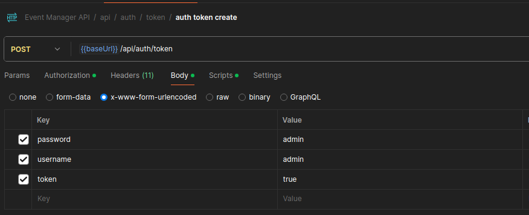

# Event Manager

## Prerequisites

Install requirements via:

```shell
make install
```

## How to run

Run migrations, create a superuser and start your development server:

```shell
./manage.py migrate
./manage.py createsuperuser
./manage.py run_server
```

## How to test

Run tests with coverage

```shell
make tests
```

You can manually test the API with the postman collection:

1. Import the [postman collection](./Event%20Manager%20API.postman_collection.json).
2. Add your user credentials to the `auth token create` url body and send the request. It will store the token
   automatically on your variables.



3. Tests all the endpoints.